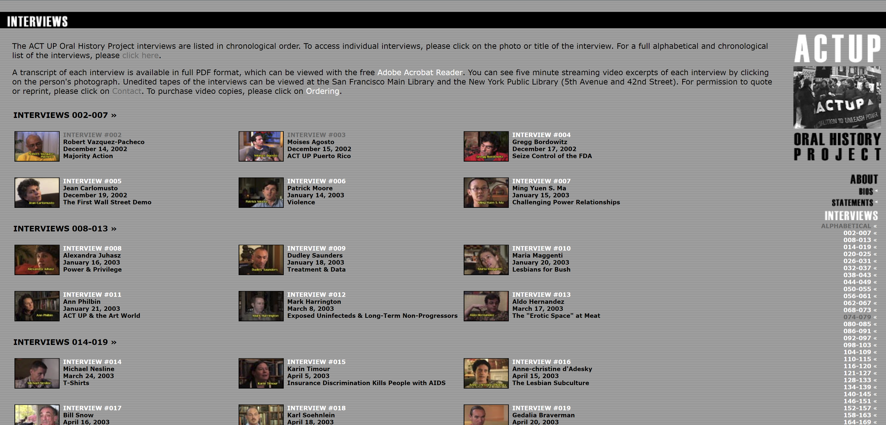

# Source Analysis

## Basic Source Information

* Our chosen source was taken directly from the [ACTUP Oral History Project website](http://actuporalhistory.org).
* The source is specifically  a collection of transcripts from interviews taken place between 2002 and 2015.
* The project was coordinated by filmmaker Jim Hubbard and Humanities Professor Sarah Schulman. The host for the source is MIX, or the New York Queer Experimental Film Festival. 
=======

---

## Authorship

There is some information that can be inferred from the transcripts of the interviews that reveals the general process for gathering the
information. Every interview starts with the interviewer asking the subject to say their name, the date, the address the interview
is taking place at, and the age of the subject. It can be assumed from the concept for the dataset that the goal of the organization is
to interview all surviving members of ACT UP, New York. Meaning that there is no previous screening process to determine who is
interviewed. Based solely on the organizations website and the amount of information provided about the data, it is apparent that the
project is transparent about their intentions and the methods used to gather the data. As stated on the website, “The purpose of this
project is to present comprehensive, complex, human, collective, and individual pictures of the people who have made up ACT UP/New
York.” Additionally, “We hope that this information will de-mystify the process of making social change, remind us that change can be
made, and help us understand how to do it.” 

The “About” section of the website is quite extensive and covers their agendas and goals in depth and openly. Although we do not have
a way to know for sure there is no hidden agenda, there is no obvious evidence to be suspicious of. They have received funding from
various grants and donors, such as the Ford Foundation, the Andy Warhol Foundation for the Visual Arts, Broadway Cares/ Equity Fights
AIDS, and many more foundations and hundreds of individuals. It would appear that most or all backers are pro-gay rights and actively
support projects supporting LGTBQ+ creativity, learning, and growth.

---

## Data Analysis

The data itself reflects the literal perspectives and experiences of remaining ACT UP, New York members. Therefore, the dataset as a whole could be considered bias as there is a lack of outside opinion of the organization, however that perspective can be found elsewhere. The classifications for the data include the name of the subject, the date of which the oral history was taken, and the focus of the subject being interviewed/ what they chose to talk about most within their interview. We do find these categorizations reasonable, however we would have also liked to have the categorizations by gender, race, interviewer and sexuality. The method of data collection did impact how the data was constructed, as any useful information on the interviews were located within a pdf file. Additionally, it being a series of oral histories, the data was collected verbally in the presence of an interviewer and a camera-person. This likely also impacted how the data was constructed. Unfortunately, the website did not provide any tools for visualizations, or even an opportunity for interactivity with the information. It seems the creators simply wanted to collect the information and have a place contain it, rather than posing any tangible arguments.
