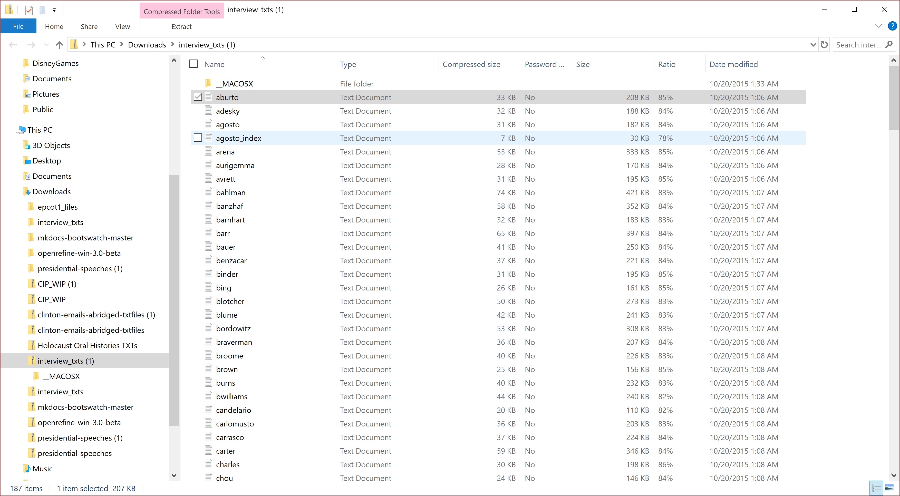
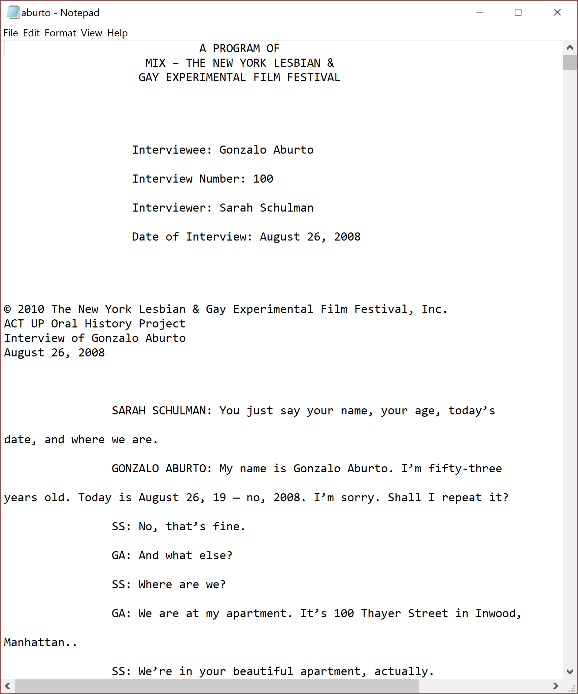
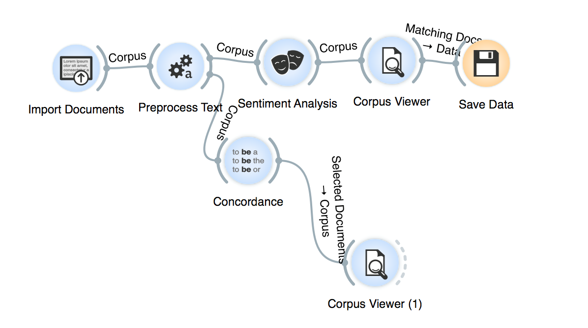
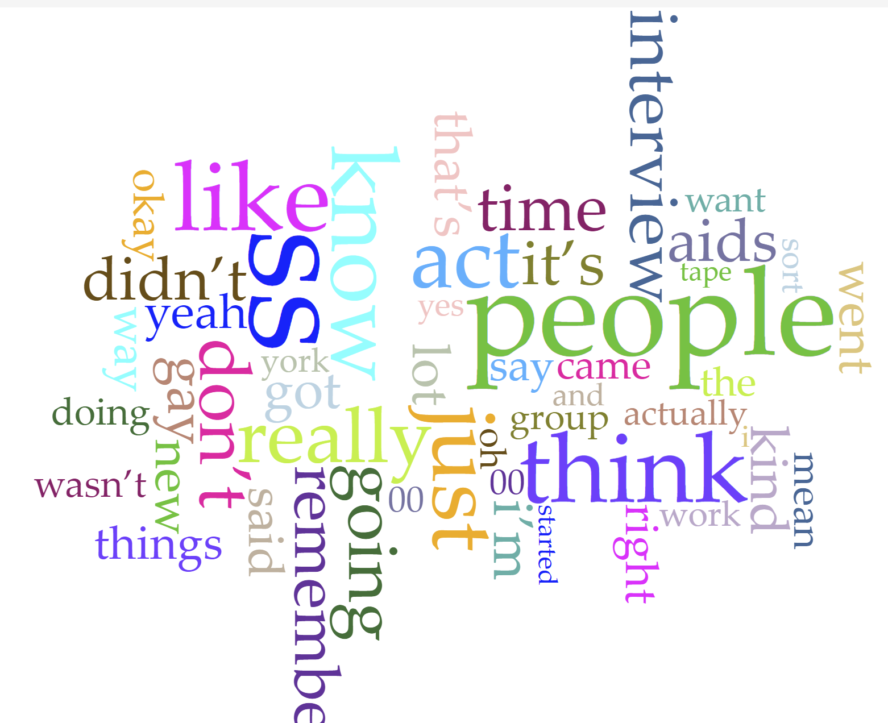
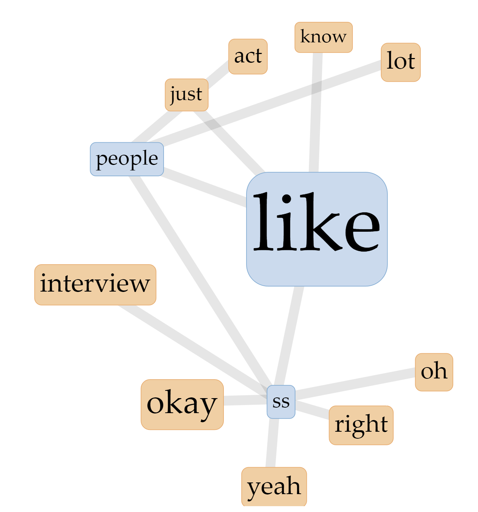

# Workflow

The overall process of our project was a long series of trails and errors, as is most projects in the field of Digital Humanities. Through this process we encountered many successes, but even more failures. In general, both Catherine and Kelly worked together to create various visualizations with the data provided by David Thomas. Individually  they analyzed these visualizations, coming to a general conclusion about the data from the [ACTUP Oral History Project](http://actuporalhistory.org/index1.html).
=======

---

As stated previously, when deciding on a topic to peruse for our Pilot Project, we both agreed that our mutual interest in LGBTQ+ history would be the focal point for their search. Kelly discovered the ACTUP Oral History Project after many hours searching for a historical database related to LGBTQ+ studies. With limited options available, and the genuine interest we had in ACTUP, we decided to attempt to analyze this source for our project.

[David Thomas](http://theportus.com) provided us with txt files of oral history transcripts from ACT UP's online oral history repository. This was completed via a [webscarape](http://webscraper.io/) accomplished in 2017. To complete this webscrape normally, we would have had to open all 186 PDF files at once and scrape each document individually. Professor Thomas was kind enough to save us the time and headache by providing us the data from his webscrape.

From those txt files we were able to upload them into [Orange Three](https://orange.biolab.si) and [Voyant](http://voyant-tools.org/). Catherine tackled Orange 3, while Kelly used Voyant.

Once we received the txt files Catherine attempted to put them into Tableau, however it turned out that it was initially incompatible. She then attempted to use Gephi, which also failed. Realizing that we needed to put the data into a format that could be read by Tableau, she put the files into Orange 3 and then attached them to pre-process text and from there we were able to receive outputs of data. She then saved that data as a CSV file and uploaded it into Tableau. While attempting to do all of these things, Catherine's computer repeatedly shut down and provided to be very difficult for her.

In Voyant, Kelly tried various configurations and visualizations to extract information from the collection of transcripts. Unlike with Orange 3, there wasn't any obvious way to add stop-words to the data, meaning that abbreviations like "SS" and common, formal words such as "like" were included in word counts and links, leading to some less than useful visualizations. None the less, she still managed to produce a couple very helpful tables and visuals, as seen in the "Initial Findings" page. down and provided to be very difficult for her.

In summary, the overall workflow of this project was a primarily even split between both group members. Each one of us taking a program we were most comfortable with and attempting to extract what we could from the program. Although the results weren't all we hoped they would be, we both still learned a great deal from trial and error. In terms of analyzing the data we found, both Catherine and Kelly read over and discussed the various visualizations each had created. We decided that the visualizations that held the most weight came from Catherine's work with Orange3 and Tableu, although Voyant was far easier to use. 

